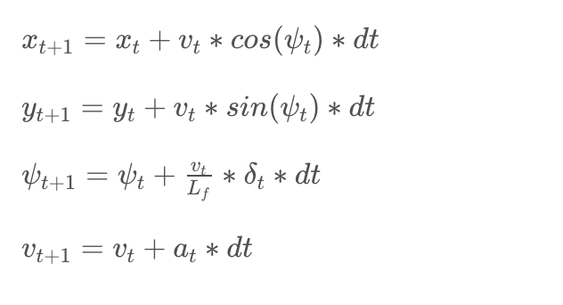
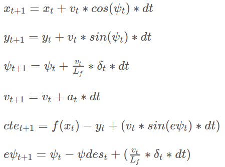

# Model Predictive Control for Self-Driving Cars
Self-Driving Car Engineer Nanodegree Program
---

## Description

This project implements a Model Predictive Control (MPC)-based controller for an autonomous vehicle that steers it around a simulated track. In a nutshell, the simulator feeds the controller its current state (speed, steering, throttle) and waypoints, and the controller creates a reference trajectory, along the center of the lane, and attempts to follow the reference trajactory as closely as possible, without steering off the track.  

The GIF of one such successful run around the track, at 75 mph max speed, is shown here:


### The Vehicle Model

The model used is a simple kinematic model that fits a bicycle: the model takes into account speed, heading (orientation/steering), but ignores dynamic forces such as gravity, longitudinal / lateral forces on tires, air resistance, drag, mass and geometry of vehicle. The state of the model is described `X, Y` coordinates, the Orientation angle `Psi (ψ)`, and Velocity `v`. 
```
 State: [x,y,ψ,v]
```
The actuations act as inputs to Steering wheel and the Throttle (acceleration/deceleration) and are described by `[δ,a]` respectively.
```
Actuators: [δ,a]
```

The State equations describe how the next state is calculated from the current state, over a time period `dt`.


Here, the `Lf` is the the vehicle's maneouverability, and is the distance between its center of gravity and front wheels, and is determined empirically.

The model works by tracking two errors: `Cross Tracking Error (CTE)` and `Orientation Error (Epsi)`, and by attempting to reduce these two errors as it follows a reference trajectory. The equations are:



### MPC Implementation

To implement MPC, use was made of sample code from the _MPC Quizzes_ section. 

### Time Step and Duration

The MPC model works by creating a (predicted) reference trajectory for `T` seconds ahead on the horizon of its current position. Since `T = N * dt`, where `N` is number of timesteps and `dt` is the timeperiod delta (in seconds), I started off with small values of N and dt. Larger values of T means longer horizong and smoother changes over time, but also larger deviations in tracking as horizons can change dramatically; smaller T means shorted horizons, more responsiveness and more accurate, but means more discrete changes. Using a reference target speed of 50 mph, I started with `dt = 0.05` and `N = 10`. Increasing the max velocity led to oscillations of vehicle. In the, with trial and error, I settled down to `N = 20` and `dt = 0.05`, with velocity slowly increasing from ~30 mph to 75 mph (final).

### Cost and Error Tracking

The model calculates error by assigning a Cost function and fitting a polynomial to the reference (projected) trajectory, iteratively for each waypoint. As the vehicle's current state matches the reference trajectory, the error from deviation (or cost) is minimized; as the vehicle does not match the trajectory, the error (or cost) increases. The optimization to reduce the cost function is performed by `IpOpt` library.

The cost function includes three components, as shown below:
1. Cost based on Reference State. This cost penalizes the magnitude of CTE and Epsi; the larger the magnitudes, the higher the costs.
2. Cost based on Rate of Change of Actuations. This cost penalizes the *rate of change* of CTE and Epsi, so that vehicles do not abruptly jerk left/right.
3. Cost based on Sequential Actuations. This cost penalizes the gap between sequential actuations.

```
// 1. Cost Function
    // State: [x,y,ψ,v,cte,eψ]
    // 1a - Cost based on Reference State; for Trajectory, set cost to 0 (i.e. follow Reference)
    for (int t = 0; t < N; t++) {
      fg[0] +=  1.0 * CppAD::pow(vars[cte_start + t] - REF_CTE, 2);   // Cross Track Error
      fg[0] +=  1.0 * CppAD::pow(vars[epsi_start + t] - REF_EPSI, 2); // Orientation error
      fg[0] +=  1.0 * CppAD::pow(vars[v_start + t] - REF_V, 2);       // Velocity error 
    }

    // 1b - Minimise the use of Actuators, i.e. minimize the change rate ([δ,a])
    // Add Scaling factor to smooth out
    for (int t = 0; t < N - 1; t++) {
      fg[0] +=  SCALE_DELTA * CppAD::pow(vars[delta_start + t], 2); // steering angle
      fg[0] +=  SCALE_ACC   * CppAD::pow(vars[a_start + t], 2);     // acceleration (throttle)
    }

    // 1c - Minimize the value gap between sequential actuations
    // Add Scaling factor to smooth out
    for (int t = 0; t < N - 2; t++) {
      fg[0] +=  SCALE_DELTA_D * CppAD::pow(vars[delta_start + t + 1] - vars[delta_start + t], 2); 
      fg[0] +=  SCALE_ACC_D   * CppAD::pow(vars[a_start + t + 1]  - vars[a_start + t], 2);
    }
```
To account for sudden changes in CTE and EPsi, a scaling factor was added that keeps the various cost components together. This nicely enables us to tune the various cost components individually.

```
// Scale factors for Cost components
const double SCALE_DELTA  = 1.0;
const double SCALE_ACC    = 10.0;
const double SCALE_DELTA_D = 400.0;
const double SCALE_ACC_D  = 2.0;
```
Increasing the weight on different cost components ensures smoother vehicle handling (turns and acceleration). A major effort of tuning went into selecting various values by trial and error. The Cost function is implemented in `FG_eval`.

### Polynomial Fitting

The simulator sends its coordinates to the MPC controller in the global Map coordinates. These waypoints are converted into Vehicle's coordinates using a transform. This is implemented in `convertoToCarCoordinates` in `main.cpp`. The transform essentially shifts the origin to the vehicle's current position, and then applies a 2D rotation to align x-axis to the heading of the vehicle. 

```
New X = cos(psi) * (mapX - x) + sin(psi) * (mapY - y)
New Y = -sin(psi) * (mapX - x) + cos(psi) * (mapY - y)
```
This ensures that state of the vehicle is `[0, 0, 0, v, cte, epsi]` (the first three 0s are x,y,psi).

### Latency

In real world, the actuations on steering and throttle take finite amount of time to take effect. In this case, a latency of 100 ms is given. When latency delays are not taken into account, the vehicle can sometimes be in an unpredictable state.

To counter the effect of latency, constraints were introduced for the duration of latency (100 ms, which is 2 `dt` timesteps). The actuations values of previous iteration were stored and applied for the duration of latency; this ensures that actuations are smooth, and optimal trajectory is calculated starting from time after the latency. This is implemented in `MPC::Solve`.

---

## Dependencies

* cmake >= 3.5
 * All OSes: [click here for installation instructions](https://cmake.org/install/)
* make >= 4.1
  * Linux: make is installed by default on most Linux distros
  * Mac: [install Xcode command line tools to get make](https://developer.apple.com/xcode/features/)
  * Windows: [Click here for installation instructions](http://gnuwin32.sourceforge.net/packages/make.htm)
* gcc/g++ >= 5.4
  * Linux: gcc / g++ is installed by default on most Linux distros
  * Mac: same deal as make - [install Xcode command line tools]((https://developer.apple.com/xcode/features/)
  * Windows: recommend using [MinGW](http://www.mingw.org/)
* [uWebSockets](https://github.com/uWebSockets/uWebSockets)
  * Run either `install-mac.sh` or `install-ubuntu.sh`.
  * If you install from source, checkout to commit `e94b6e1`, i.e.
    ```
    git clone https://github.com/uWebSockets/uWebSockets 
    cd uWebSockets
    git checkout e94b6e1
    ```
    Some function signatures have changed in v0.14.x. See [this PR](https://github.com/udacity/CarND-MPC-Project/pull/3) for more details.
* Fortran Compiler
  * Mac: `brew install gcc` (might not be required)
  * Linux: `sudo apt-get install gfortran`. Additionall you have also have to install gcc and g++, `sudo apt-get install gcc g++`. Look in [this Dockerfile](https://github.com/udacity/CarND-MPC-Quizzes/blob/master/Dockerfile) for more info.
* [Ipopt](https://projects.coin-or.org/Ipopt)
  * Mac: `brew install ipopt`
  * Linux
    * You will need a version of Ipopt 3.12.1 or higher. The version available through `apt-get` is 3.11.x. If you can get that version to work great but if not there's a script `install_ipopt.sh` that will install Ipopt. You just need to download the source from the Ipopt [releases page](https://www.coin-or.org/download/source/Ipopt/) or the [Github releases](https://github.com/coin-or/Ipopt/releases) page.
    * Then call `install_ipopt.sh` with the source directory as the first argument, ex: `bash install_ipopt.sh Ipopt-3.12.1`. 
  * Windows: TODO. If you can use the Linux subsystem and follow the Linux instructions.
* [CppAD](https://www.coin-or.org/CppAD/)
  * Mac: `brew install cppad`
  * Linux `sudo apt-get install cppad` or equivalent.
  * Windows: TODO. If you can use the Linux subsystem and follow the Linux instructions.
* [Eigen](http://eigen.tuxfamily.org/index.php?title=Main_Page). This is already part of the repo so you shouldn't have to worry about it.
* Simulator. You can download these from the [releases tab](https://github.com/udacity/self-driving-car-sim/releases).
* Not a dependency but read the [DATA.md](./DATA.md) for a description of the data sent back from the simulator.


In the end, the vehicle ran along the track successfully at a max speed limit of 75 mph. 👍

---

## Basic Build Instructions


1. Clone this repo.
2. Make a build directory: `mkdir build && cd build`
3. Compile: `cmake .. && make`
4. Run it: `./mpc`.

## Tips

1. It's recommended to test the MPC on basic examples to see if your implementation behaves as desired. One possible example
is the vehicle starting offset of a straight line (reference). If the MPC implementation is correct, after some number of timesteps
(not too many) it should find and track the reference line.
2. The `lake_track_waypoints.csv` file has the waypoints of the lake track. You could use this to fit polynomials and points and see of how well your model tracks curve. NOTE: This file might be not completely in sync with the simulator so your solution should NOT depend on it.
3. For visualization this C++ [matplotlib wrapper](https://github.com/lava/matplotlib-cpp) could be helpful.

## Editor Settings

We've purposefully kept editor configuration files out of this repo in order to
keep it as simple and environment agnostic as possible. However, we recommend
using the following settings:

* indent using spaces
* set tab width to 2 spaces (keeps the matrices in source code aligned)

## Code Style

Please (do your best to) stick to [Google's C++ style guide](https://google.github.io/styleguide/cppguide.html).

## Project Instructions and Rubric

Note: regardless of the changes you make, your project must be buildable using
cmake and make!

More information is only accessible by people who are already enrolled in Term 2
of CarND. If you are enrolled, see [the project page](https://classroom.udacity.com/nanodegrees/nd013/parts/40f38239-66b6-46ec-ae68-03afd8a601c8/modules/f1820894-8322-4bb3-81aa-b26b3c6dcbaf/lessons/b1ff3be0-c904-438e-aad3-2b5379f0e0c3/concepts/1a2255a0-e23c-44cf-8d41-39b8a3c8264a)
for instructions and the project rubric.

## Hints!

* You don't have to follow this directory structure, but if you do, your work
  will span all of the .cpp files here. Keep an eye out for TODOs.

## Call for IDE Profiles Pull Requests

Help your fellow students!

We decided to create Makefiles with cmake to keep this project as platform
agnostic as possible. Similarly, we omitted IDE profiles in order to we ensure
that students don't feel pressured to use one IDE or another.

However! I'd love to help people get up and running with their IDEs of choice.
If you've created a profile for an IDE that you think other students would
appreciate, we'd love to have you add the requisite profile files and
instructions to ide_profiles/. For example if you wanted to add a VS Code
profile, you'd add:

* /ide_profiles/vscode/.vscode
* /ide_profiles/vscode/README.md

The README should explain what the profile does, how to take advantage of it,
and how to install it.

Frankly, I've never been involved in a project with multiple IDE profiles
before. I believe the best way to handle this would be to keep them out of the
repo root to avoid clutter. My expectation is that most profiles will include
instructions to copy files to a new location to get picked up by the IDE, but
that's just a guess.

One last note here: regardless of the IDE used, every submitted project must
still be compilable with cmake and make./
